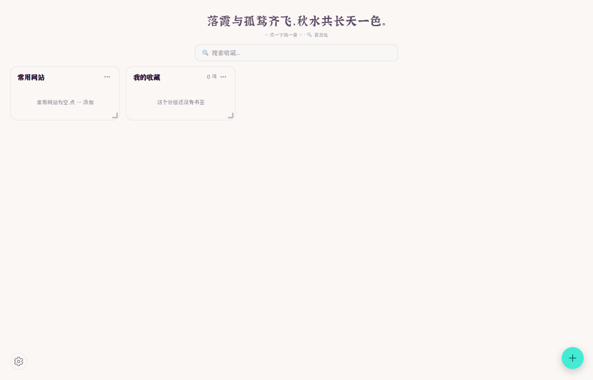
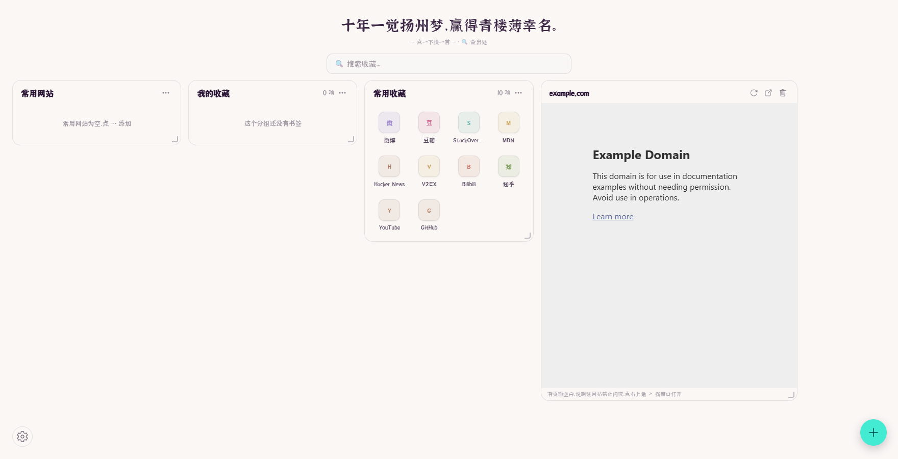

<p align="center">
  
</p>

<h1 align="center">Poetry-Tab</h1>

<p align="center"><b>古诗词 · 收藏看板 · 云同步 —— 你的新标签页，一屏装下诗与远方</b></p>

<p align="center">
  <a href="#-功能特性">功能</a> ·
  <a href="#-快速开始">快速开始</a> ·
  <a href="#-使用指南">使用指南</a> ·
  <a href="#-架构">架构</a> ·
  <a href="#-云端数据契约">数据契约</a> ·
  <a href="#-开发">开发</a> ·
  <a href="#-部署">部署</a>
</p>

<p align="center">
  
</p>

---

## ✨ 功能特性

### 📜 古诗词
- 每次打开新标签页展示一首诗词，**点击即可换一首**；一轮内不重复，读完一轮自动重新洗牌
- 内置 **12 个分类**（诗词、文学、哲学、动画、影视、网易云等），在设置中自由勾选启用
- 诗词支持「🔍 查出处」，一键跳转搜索引擎查询出处与全文
- 超长诗句单行展示，超出自动省略号截断，页面高度恒定不跳动

### 🔍 智能搜索框
- **搜索自己的收藏**：输入即匹配分组/书签/常用网站，显示所在路径
- **搜索引擎直达**：百度 / Google / Bing / DuckDuckGo 随设置切换
- 搜索框默认隐藏：右上角 🔍 按钮、快捷键 `S` 呼出，`Esc` 关闭

### 🗂 收藏看板（核心）
<p align="center">
  
</p>

- **常用网站**：高频站点单独一张卡片
- **分组书签**：自建分组，卡片内书签磁贴铺开完整可见；子分组自动变卡片标签页
- **iframe 小部件**：把任意网站直接内嵌进新标签页（监控面板、文档站、日历……）
- **网格布局，手感一流**：
  - 按住卡片标题**拖动排序**——跟手浮层 + 其余卡片平滑让位（dnd-kit）
  - 右下角把手**自由拉伸**——虚线吸附预览框 + 实时尺寸徽标（如「4 列 × 2 行」），松手一次落位
  - 卡片内容**永远完整展开**，拉伸只改变下限，绝不在卡片里藏滚动条
  - 列数随窗口宽度自适应 **10 / 6 / 4 / 2** 列，手机上也不错
- **右下角悬浮按钮（FAB）**：新建分组 / 添加 iframe 小部件，不占网格

### ☁️ 云同步
- 一套**用户 ID** 走天下：同一 ID 在浏览器扩展、任何设备的网页上打开，都是同一份收藏
- 修改 **700ms 防抖自动保存**；设置面板亦可手动「上传到云端 / 从云端恢复」
- 服务端保留 **5 个历史版本快照**，误删可回滚
- 支持本地缓存离线渲染，弱网/断网先看缓存再同步

### ⚙️ 设置
| 设置项 | 说明 |
|---|---|
| 主题 | 浅色 / 深色 / 跟随系统（入口：右上角 ⚙） |
| 搜索引擎 | 百度 / Google / Bing / DuckDuckGo |
| 展示类别 | 12 个诗词分类任意组合（至少一个） |
| 云同步 | 用户 ID、上传到云端、从云端恢复 |

---

## 🚀 快速开始

### 方式一：Chrome 扩展
1. 下载发布包并解压（或自行构建，见[开发](#-开发)）
2. 打开 `chrome://extensions` → 右上角开启「开发者模式」
3. 「加载已解压的扩展程序」→ 选择本目录
4. 新开一个标签页即可使用

### 方式二：网页版（免安装）
直接访问 **https://sync.pathmemos.com**，与扩展共用同一套云数据。

> 扩展与网页版功能完全一致（同一套 React 代码双端构建），数据实时互通。

---

## 📖 使用指南

### 首次使用
打开新标签页会看到「云端收藏夹」输入框：
- **新建用户**：输入一个你记得住的 ID（如 `my-poetry`），回车即创建专属收藏夹
- **打开**：在别的设备上已用过？输入同一个 ID 即可接续

> ID 即身份，无密码。请自行保管好 ID，知道 ID 的人都能访问你的收藏。

### 看板操作
| 操作 | 方式 |
|---|---|
| 新建分组 / 添加小部件 | 右下角 **＋** 悬浮按钮 |
| 收录书签 | 卡片右上角 **⋯** → 填标题与网址 → 收录 |
| 编辑 / 删除书签 | 同一管理面板中操作 |
| 重命名 / 删除分组 | 管理面板标题旁铅笔 / 底部删除按钮（两次确认） |
| 拖动排序 | 按住**卡片标题栏**拖动，其他卡片自动让位 |
| 调整大小 | 拖卡片**右下角把手**：横向调宽度、纵向调最小高度（虚线预览 + 徽标实时提示） |
| 查看 iframe 内容 | 部分网站禁止内嵌时，点卡片右上角 **↗** 新窗口打开 |

### 诗词
- 点击诗词区域 → 换一首
- 点「🔍 查出处」→ 搜索该句出处

---

## 🏗 架构

```
┌───────────────────────────────────────────────┐
│              一套 React 代码（src/pages/newtab）              │
├──────────────────────┬──────────────────────────┤
│   Chrome 扩展（WXT）    │     网页版（Vite → dist-web）   │
│   newtab 覆盖新标签页     │   任意浏览器访问，免安装          │
└──────────┬───────────┴──────────┬───────────┘
           │      读写同一份云数据（700ms 防抖）      │
           ▼                      ▼
┌───────────────────────────────────────────────┐
│      Cloudflare Worker（sync.pathmemos.com）        │
│  静态资源（ASSETS）+ 同步 API + R2 五版本快照          │
└───────────────────────────────────────────────┘
```

**技术栈**：WXT 0.20 · React 19 · Vite 7 · Tailwind CSS 4 · daisyUI 5 · dnd-kit · Cloudflare Workers + R2

---

## ☁️ 云端数据契约

存储路径：R2 桶 `proton-collect-sync` 下的 `collections/<uid>.json`，保留最近 5 个版本快照。
所有请求经 `Authorization: Bearer <token>` 认证（token 由 Worker 注入页面，扩展内置同一 token）。

```jsonc
{
  "v": 2,
  "folders": [                      // 分组（顶层卡片）
    {
      "id": "f_xxx",
      "title": "AI 工具",
      "children": [                  // 书签；子分组则含 children（卡片内变标签页）
        { "id": "b_xxx", "title": "ChatGPT", "url": "https://chat.openai.com", "favicon": "", "dateAdded": 0 }
      ]
    }
  ],
  "quickSites": [                   // 常用网站卡片
    { "id": "qs_xxx", "title": "GitHub", "url": "https://github.com", "favicon": "" }
  ],
  "iframeWidgets": [                // iframe 内嵌小部件卡片
    { "id": "iw_xxx", "title": "example", "url": "https://example.com", "width": 560 }
  ],
  "settings": {                     // 同步的设置
    "theme": "sync",                // sync | light | dark
    "engine": "baidu",              // baidu | google | bing | duckduckgo
    "cats": ["i"]                   // 启用的诗词分类
  },
  "layout": [                       // 看板布局：数组顺序即显示顺序
    { "i": "qs:quicksites", "w": 2, "h": 0 },
    { "i": "f:f_xxx",       "w": 2, "h": 0 }
    // i  = 卡片标识（qs:常用网站 / f:分组 / w:iframe）
    // w  = 列跨度（以「参考 10 列」为坐标系存储，渲染时按实际列数 10/6/4/2 等比换算）
    // h  = 最小行数（单位为固定像素行，0 表示不设下限；内容永远完整展开）
  ]
}
```

**API**：
- `GET /api/sync/:uid` → 读取收藏（含 `savedAt`）
- `PUT /api/sync/:uid` → 整体写入（服务端自动轮转历史快照）

---

## 💻 开发

```bash
pnpm install        # 安装依赖

pnpm dev            # 扩展开发模式（热更新，浏览器加载 .output/chrome-mv3）
pnpm build          # 构建扩展 → .output/chrome-mv3
pnpm build:web      # 构建网页版 → dist-web
pnpm zip            # 打包扩展 zip
```

**目录结构**：
```
├── entrypoints/newtab/     # 扩展新标签页入口（WXT）
├── src/pages/newtab/       # 双端共享的 React 应用（核心代码）
│   ├── App.jsx             # 页面组装：诗词 → 搜索 → 看板 → 设置
│   ├── components/         # BookmarkBoard / BookmarkSearch / SettingsPanel
│   ├── hooks/              # useCollection（云数据层）/ useContentEngine（诗词引擎）
│   ├── services/           # collection（数据契约）/ contentEngine（诗词源）
│   └── grid.js             # 网格坐标系工具
├── web/                    # 网页版入口
├── vite.web.config.mjs     # 网页版构建配置
├── assets/fonts/           # 江西拙楷字体
└── preview/                # 文档截图
```

**E2E 测试**（Playwright，位于 `../ext-test/`）：
- `test-rgl.cjs` — 看板全流程回归（14 步：登录/建分组/收录/小部件/拖动/拉伸/云端布局/双端一致/手机视口）
- 云端断言直接读取 `GET /api/sync/:uid` 比对

---

## 🚢 部署

### 网页版 + 同步服务（Cloudflare）
```bash
pnpm build:web
# 将 dist-web 与 worker 源码同步到构建机后：
wrangler deploy        # 详见 worker 目录的 wrangler.toml（路由、R2 绑定、token secret）
```
- 域名 `sync.pathmemos.com` 绑定为 Worker 自定义域
- `SYNC_TOKEN` 通过 `wrangler secret put` 配置，前端由 Worker 注入页面

### 扩展分发
- `pnpm build` 后加载 `.output/chrome-mv3`，或 `pnpm zip` 出分发包
- 云同步 token 已内置于构建产物中，分发即用

---

## 🔒 隐私

- 收藏数据存在**你自己的** Cloudflare R2 中，不经手任何第三方
- 无埋点、无追踪、无广告
- 用户 ID 即访问凭证，请妥善保管

## 📄 License

[MIT](LICENSE)。诗词数据来自开源项目 [sentences-bundle](https://github.com/hitokoto-osc/sentences-bundle)（Hitokoto），字体为[江西拙楷](https://chinese-font.netlify.app/)（中文网字计划）。
