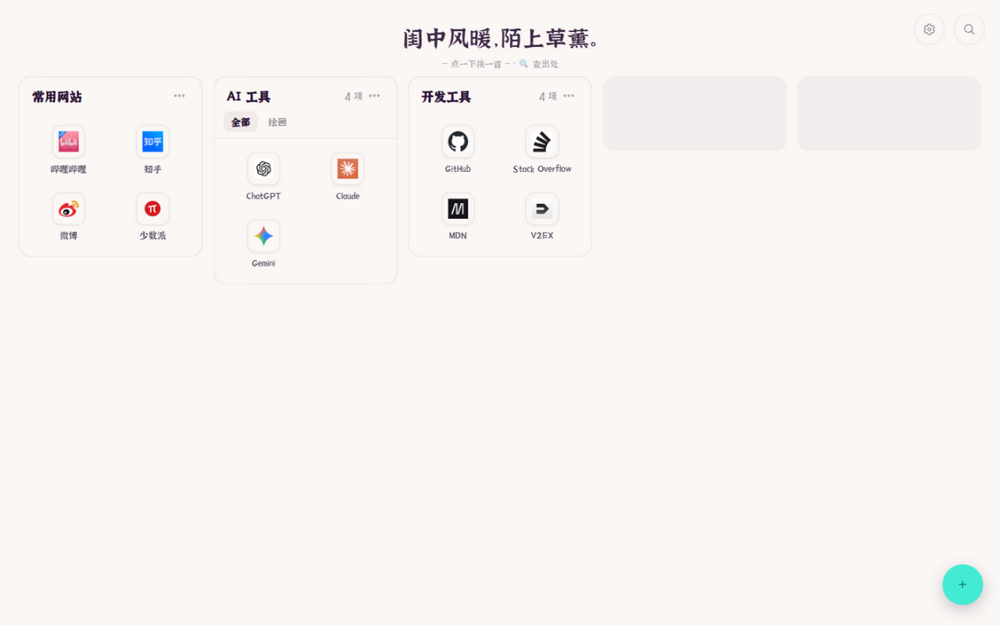
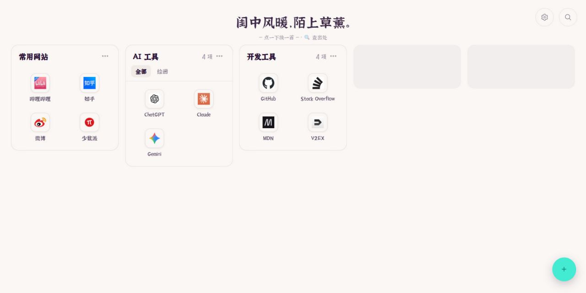

<p align="center">
  
</p>

<h1 align="center">Poetry-Tab</h1>

<p align="center"><b>古诗词 · 收藏看板 · 云同步 —— 你的新标签页，一屏装下诗与远方</b></p>

<p align="center">
  <a href="#-功能特性">功能</a> ·
  <a href="#-快速开始">快速开始</a> ·
  <a href="#-使用指南">使用指南</a> ·
  <a href="#-架构">架构</a> ·
  <a href="#-云端数据契约">数据契约</a> ·
  <a href="#-开发">开发</a> ·
  <a href="#-部署">部署</a>
</p>

<p align="center">
  
</p>

---

## ✨ 功能特性

### 📜 古诗词
- 每次打开新标签页展示一首诗词，**点击即可换一首**；一轮内不重复，读完一轮自动重新洗牌
- 内置 **12 个分类**（诗词、文学、哲学、动画、影视、网易云等），在设置中自由勾选启用
- 诗词支持「🔍 查出处」，一键跳转搜索引擎查询出处与全文
- 超长诗句单行展示，超出自动省略号截断，页面高度恒定不跳动

### 🔍 智能搜索框
- **搜索自己的收藏**：输入即匹配分组/书签/常用网站，显示所在路径
- **拼音与首字母**：`weibo` 命中「新浪微博」、`blbl` 命中「哔哩哔哩」（pinyin-pro 按需加载）
- **搜索引擎直达**：百度 / Google / Bing / DuckDuckGo 随设置切换
- 默认隐藏给诗词留白：`S` 呼出、`Esc` 收起；设置 → 外观可开启「搜索栏常驻」（随账号同步）
- **数字键直达**：按 `1-9` 直接打开常用网站前 9 个

### 🗂 收藏看板（核心）
<p align="center">
  
</p>

- **常用网站**：高频站点单独一张卡片（favicon 经同步服务代理，国内可达）
- **分组书签**：自建分组，卡片内书签磁贴铺开完整可见；**支持二级子分组**（卡片内标签页展示，管理面板可创建/进入）；**批量收录**（多行文本一行一条）；**名称留空自动取网页标题**（服务端代理）
- **iframe 小部件**：把任意网站直接内嵌进新标签页（监控面板、文档站、日历……）；视口内才加载、会话内不重载，操作收进 ⋯ 菜单（高度预设档位或自定义像素值，随账号同步）
- **一键导入浏览器书签**：扩展端直接读浏览器书签树；网页版导入导出的书签 HTML（重复网址自动跳过）
- **误删无忧**：删除书签/分组/小部件后 6 秒内可一键撤销
- **列式看板，顺滑流畅**：
  - 卡片按列排布、每列等宽；列数可设（自动 5/4/3/2 或固定 2-5，随账号同步），手机自动单列满宽
  - 按住卡片标题**拖动**——列内上下排序、跨列移动，其余卡片实时让位（纯 CSS 流式布局，无逐卡测量，天然流畅）
  - 视口外的卡片自动跳过渲染（content-visibility），上百卡片也流畅
- **右下角悬浮按钮（FAB）**：新建分组 / 添加 iframe 小部件，不占网格

### ☁️ 云同步
- 一套**用户 ID** 走天下：同一 ID 在浏览器扩展、任何设备的网页上打开，都是同一份收藏
- 修改 **700ms 防抖自动保存**；同浏览器多标签页经 BroadcastChannel 即时互通
- **多设备冲突强制仲裁**：云端被他设备更新且本地有未同步修改时，暂停自动保存，由你在「上传到云端（本地为准）/ 从云端恢复（云端为准）」中明确选择，绝不静默覆盖
- 服务端保留 **5 个历史版本快照**，设置面板可查看并一键恢复（恢复动作本身也留快照，可再撤销）
- 支持**导出 / 恢复 JSON 备份**；本地缓存离线渲染，弱网/断网先看缓存再同步，GET 带 ETag 未变化零流量

### ⚙️ 设置
设置面板为居中弹窗，分三个标签页：
| 标签页 | 内容 |
|---|---|
| 外观 | 主题（浅色/深色/跟随系统）、搜索引擎、**诗词区留白**、搜索栏常驻、看板列数、展示类别、**卡片显隐** |
| 云同步 | 用户 ID + 密码登录、上传到云端、从云端恢复、退出登录 |
| 导入与备份 | 导入浏览器书签 / 书签 HTML、导出 / 恢复 JSON 备份、历史版本快照恢复 |

---

## 🚀 快速开始

### 方式一：Chrome 扩展
1. 下载发布包并解压（或自行构建，见[开发](#-开发)）
2. 打开 `chrome://extensions` → 右上角开启「开发者模式」
3. 「加载已解压的扩展程序」→ 选择本目录
4. 新开一个标签页即可使用

### 方式二：网页版（免安装）
直接访问 **https://sync.pathmemos.com**，与扩展共用同一套云数据。

> 扩展与网页版功能完全一致（同一套 React 代码双端构建），数据实时互通。

---

## 📖 使用指南

### 首次使用
打开新标签页会看到登录门：
- **新建用户**：输入一个你记得住的 ID（如 `my-poetry`）和密码（至少 6 位），点「新建用户」即创建账号
- **登录**：在别的设备上已用过？同一 ID + 密码登录即可接续

> ID + 密码即账号，无需邮箱注册。密码只在本地经 PBKDF2 派生后以挑战应答方式登录，明文永不上传、服务端只存派生结果。

### 看板操作
| 操作 | 方式 |
|---|---|
| 新建分组 / 添加小部件 | 右下角 **＋** 悬浮按钮 |
| 管理书签 / 子分组 | 卡片右上角 **⋯** 打开管理工作台：左栏分组树、右栏列表（搜索 / 拖拽排序 / 点行编辑 / ⋯ 菜单） |
| 收录书签 | 工作台右上「**＋ 收录**」；标题留空自动取网页名；「批量」支持多行粘贴 |
| 删除 | 行尾 ⋯ 菜单 → 删除（书签即删可撤销；含内容的子分组二次确认） |
| 拖动排序 | 按住**卡片标题栏**拖动（列内/跨列）；工作台列表内按行首把手拖动 |
| 查看 iframe 内容 | 部分网站禁止内嵌时，点卡片右上角 **⋯ → 新窗口打开** |

### 诗词
- 点击诗词区域 → 换一首
- 点「🔍 查出处」→ 搜索该句出处

---

## 🏗 架构

```
┌───────────────────────────────────────────────┐
│              一套 React 代码（src/pages/newtab）              │
├──────────────────────┬──────────────────────────┤
│   Chrome 扩展（WXT）    │     网页版（Vite → dist-web）   │
│   newtab 覆盖新标签页     │   任意浏览器访问，免安装          │
└──────────┬───────────┴──────────┬───────────┘
           │      读写同一份云数据（700ms 防抖）      │
           ▼                      ▼
┌───────────────────────────────────────────────┐
│      Cloudflare Worker（sync.pathmemos.com）        │
│  静态资源（ASSETS）+ 同步 API + R2 五版本快照          │
└───────────────────────────────────────────────┘
```

**技术栈**：WXT 0.20 · React 19 · Vite 7 · Tailwind CSS 4 · daisyUI 5 · dnd-kit · Cloudflare Workers + R2

---

## ☁️ 云端数据契约

存储（R2 桶，Worker 绑定名 `BUCKET`）：
- `pt/accounts/<uid>.json` —— 账号记录 `{v, iter, salt, authKey, createdAt}`
- `pt/data/<uid>.json` —— 最新数据 `{savedAt, data}`
- `pt/data/<uid>/snap-<ts>-<seq>.json` —— 历史快照（保留最近 5 份）

**账号与会话**（密码永不明文传输/存储）：
- 注册：客户端生成随机盐 → PBKDF2-SHA256(密码, 盐, 600k 迭代) 得 authKey 提交，服务端只存派生结果（R2 条件写保证并发同名注册不互相覆盖）
- 登录：`POST /api/challenge` 领取带签名的一次性挑战（附盐与迭代次数）→ 客户端重派生 authKey，以 HMAC-SHA256(authKey, challenge) 应答；**不存在的 ID 返回确定性伪盐**（响应形状一致，防账号枚举），登录失败统一提示「ID 或密码不匹配」
- 会话：登录成功发放无状态令牌 `uid|exp|HMAC(SYNC_TOKEN, uid|exp)`，30 天有效；此后数据读写仅凭令牌（`Authorization: Bearer`），uid 从令牌解析，杜绝越权

**API**（`/api/register`、`/api/challenge`、`/api/login` 无需令牌但有 per-IP 限流；其余需会话令牌）：
- `POST /api/register` `{uid, salt, authKey, iter}` → `{session}`
- `POST /api/challenge` `{uid}` → `{challenge, salt, iter}`
- `POST /api/login` `{uid, challenge, proof}` → `{session, savedAt, data}`
- `GET /api/data` → `{savedAt, data}`；携带 `If-None-Match`（上次 savedAt）命中返回 **304**，开新标签页零流量
- `PUT /api/data` 整体写入（≤8MB），携带 `X-Base-SavedAt` 乐观锁：服务端以 **R2 条件写（onlyIf etag）原子完成「校验+写入」**，并发写只成功一个，其余 409；成功后自动轮转快照
- `GET /api/snaps` → `{snaps: [{key, at}]}`（最近 5 份快照）
- `POST /api/snap/restore` `{key}` → 恢复该快照为当前数据（恢复动作也留快照）
- `GET /api/favicon?domain=` → favicon 代理（R2 缓存 30 天，Google s2 → DuckDuckGo 兜底）
- CORS 白名单含 `X-Base-SavedAt` / `If-None-Match`，本地开发与跨源环境可用完整 API

**数据格式**（`pt/data/<uid>.json` 的 `data` 字段，`v` 为 schema 版本号）：

```jsonc
{
  "v": 1,                          // schema 版本（结构迁移用）
  "folders": [                      // 分组（顶层卡片）
    {
      "id": "f_xxx",
      "title": "AI 工具",
      "children": [                  // 书签；子分组则含 children（卡片内变标签页）
        { "id": "b_xxx", "title": "ChatGPT", "url": "https://chat.openai.com", "favicon": "", "dateAdded": 0 }
      ]
    }
  ],
  "quickSites": [                   // 常用网站卡片
    { "id": "qs_xxx", "title": "GitHub", "url": "https://github.com", "favicon": "" }
  ],
  "iframeWidgets": [                // iframe 内嵌小部件卡片（h = 卡片高度，⋯ 菜单可调，云端同步）
    { "id": "iw_xxx", "title": "example", "url": "https://example.com", "h": 420 }
  ],
  "settings": {                     // 同步的设置
    "theme": "sync",                // sync | light | dark
    "engine": "baidu",              // baidu | google | bing | duckduckgo
    "cats": ["i"]                   // 启用的诗词分类
  },
  "layout": {                       // 看板布局（v2 列式）：固定 5 槽位，各槽为卡片 id 的有序数组
    "v": 2,
    "cols": [["qs:quicksites", "f:f_xxx"], ["w:iw_xxx"], [], [], []]
    // 设备按自身列数（设置 2-5 或自动 5/4/3/2）取前 N 列，溢出槽位并入末列；
    // 手机（<640px）单列按「列序 × 列内序」排列；旧版 v1 显式坐标加载时自动迁移
  }
}
```

> 并发 PUT 由服务端 R2 条件写原子仲裁：同版本只有一次写入成功，后到者收 409 进入客户端仲裁流程（本地未修改自动载入云端；有修改则明确二选一）。

---

## 💻 开发

```bash
pnpm install        # 安装依赖

pnpm dev            # 扩展开发模式（热更新，浏览器加载 .output/chrome-mv3）
pnpm build          # 构建扩展 → .output/chrome-mv3
pnpm build:web      # 构建网页版 → dist-web
pnpm zip            # 打包扩展 zip
```

**目录结构**：
```
├── entrypoints/newtab/     # 扩展新标签页入口（WXT）
├── src/pages/newtab/       # 双端共享的 React 应用（核心代码）
│   ├── App.jsx             # 页面组装：诗词 → 搜索 → 看板 → 设置
│   ├── components/         # BookmarkBoard（看板编排）/ BookmarkSearch / SettingsPanel
│   │   └── board/          # 看板子模块：layoutEngine / widgets / ManageSheet / FolderBrowser / GateScreen
│   ├── hooks/              # useCollection（云数据层）/ useContentEngine（诗词引擎）
│   ├── services/           # collection（数据契约）/ contentEngine（诗词源）/ bookmarks（书签导入）/ meta（标题代理）
│   └── grid.js             # 列数常量与自适应
├── worker/src/worker.js    # 同步 API（部署源）
├── web/                    # 网页版入口
├── vite.web.config.mjs     # 网页版构建配置
├── assets/fonts/           # 江西拙楷字体
├── docs/                   # 业务文档（产品手册 / 同步与数据 / 架构 / 商店上架）
└── preview/                # README 截图
```

**测试**：
- Worker 本地自测（无需部署，R2 内存模拟）：`node scripts/test-worker.mjs` —— 注册/防枚举/ETag/CAS/快照恢复/favicon/title/CORS 全量断言
- 线上协议冒烟：`node scripts/test-auth.mjs`
- E2E 自动化暂缺；浏览器手工回归要点见 AGENTS.md「改动后验证」

---

## 🚢 部署

### 网页版 + 同步服务（Cloudflare）
```bash
pnpm build:web
# 将 dist-web 与 worker 源码同步到构建机后：
wrangler deploy        # 详见 worker 目录的 wrangler.toml（路由、R2 绑定、token secret）
```
- 域名 `sync.pathmemos.com` 绑定为 Worker 自定义域
- `SYNC_TOKEN` 为服务端 HMAC 密钥（会话令牌与登录挑战签名），通过 `wrangler secret put` 配置，绝不下发前端

### 扩展分发
- `pnpm build` 后加载 `.output/chrome-mv3`，或 `pnpm zip` 出分发包
- 云同步 token 已内置于构建产物中，分发即用

---

## 🔒 隐私

- 收藏数据存在**你自己的** Cloudflare R2 中，不经手任何第三方
- 无埋点、无追踪、无广告；密码只在本地 PBKDF2 派生后以挑战应答方式登录，明文永不上传
- 账号凭 ID + 密码登录，请妥善保管

## 📄 License

[MIT](LICENSE)。诗词数据来自开源项目 [sentences-bundle](https://github.com/hitokoto-osc/sentences-bundle)（Hitokoto），字体为[江西拙楷](https://chinese-font.netlify.app/)（中文网字计划）。
